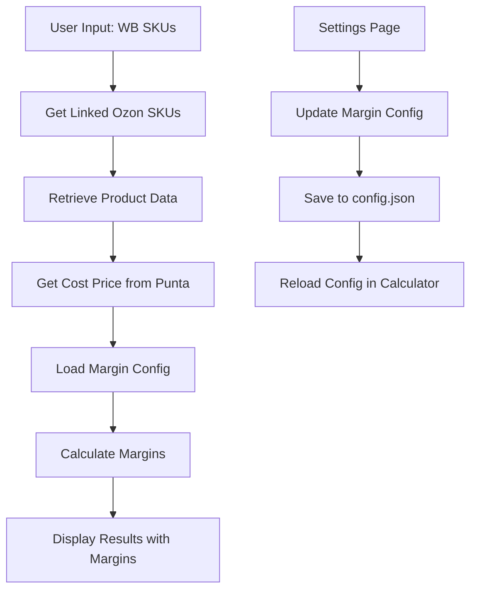

# Design Document

## Overview

The Ozon Margin Calculator feature enhances the existing advertising manager by adding comprehensive margin calculation capabilities. The solution integrates seamlessly with the current architecture, extending the configuration system, database operations, and UI components to provide real-time margin analysis for advertising candidates.

## Architecture

### System Integration Points

The feature integrates with existing components:

1. **Configuration System**: Extends `config.json` and `utils/config_utils.py` for margin parameters
2. **Database Layer**: Adds queries to retrieve `cost_price_usd` from `punta_table`
3. **UI Layer**: Enhances the advertising manager page with margin display and configuration
4. **Data Processing**: Integrates with existing product data enrichment pipeline

### Data Flow



## Components and Interfaces

### 1. Configuration Management

#### Extended Configuration Schema
```json
{
  "margin_calculation": {
    "commission_percent": 36,
    "acquiring_percent": 0,
    "advertising_percent": 3,
    "vat_percent": 20,
    "exchange_rate": 90
  }
}
```

#### New Configuration Functions
```python
# In utils/config_utils.py
def get_margin_config() -> dict
def set_margin_config(config: dict) -> None
def get_margin_parameter(param_name: str, default: float) -> float
def set_margin_parameter(param_name: str, value: float) -> None
```

### 2. Database Operations

#### Cost Price Retrieval
```python
# New function in pages/7_🎯_Менеджер_Рекламы_OZ.py
def get_cost_prices_from_punta(db_conn, wb_sku_list: list[str]) -> pd.DataFrame:
    """
    Retrieves cost_price_usd from punta_table for given WB SKUs.
    Returns DataFrame with wb_sku, cost_price_usd columns.
    """
```

#### Query Structure
```sql
WITH first_occurrences AS (
    SELECT wb_sku, cost_price_usd,
           ROW_NUMBER() OVER (PARTITION BY wb_sku ORDER BY ROWID) as rn
    FROM punta_table 
    WHERE wb_sku IN (?, ?, ...)
        AND cost_price_usd IS NOT NULL
        AND cost_price_usd > 0
)
SELECT wb_sku, cost_price_usd
FROM first_occurrences 
WHERE rn = 1
```

### 3. Margin Calculation Engine

#### Core Calculation Function
```python
def calculate_margin_percentage(
    oz_actual_price: float,
    cost_price_usd: float,
    commission_percent: float,
    acquiring_percent: float,
    advertising_percent: float,
    vat_percent: float,
    exchange_rate: float
) -> float:
    """
    Calculates margin percentage using the specified formula:
    (((oz_actual_price/(1+vat)-(oz_actual_price*((commission+acquiring+advertising)/100))/1.2)/exchange_rate)-cost_price_usd)/cost_price_usd
    """
```

#### Batch Processing Function
```python
def calculate_margins_for_dataframe(
    df: pd.DataFrame,
    margin_config: dict
) -> pd.DataFrame:
    """
    Adds margin_percent column to the dataframe with calculated margins.
    Handles missing data and edge cases gracefully.
    """
```

### 4. UI Components

#### Settings Page Enhancement
- Add new section "Margin Calculation Parameters" in `pages/3_⚙️_Настройки.py`
- Input fields for all 5 parameters with basic validation
- Save/load functionality integrated with existing settings system

#### Advertising Manager Enhancement
- Replace "скоро" placeholder with calculated margins
- Display calculated percentage or "Нет данных" for missing cost data

## Data Models

### Configuration Model
```python
@dataclass
class MarginConfig:
    commission_percent: float = 36.0
    acquiring_percent: float = 0.0
    advertising_percent: float = 3.0
    vat_percent: float = 20.0
    exchange_rate: float = 90.0
    
    def validate(self) -> list[str]:
        """Returns list of validation errors"""
```

### Calculation Result Model
```python
@dataclass
class MarginCalculationResult:
    wb_sku: str
    oz_sku: str
    margin_percent: Optional[float]
    error_message: Optional[str]
    calculation_details: Optional[dict]
```

## Error Handling

### Basic Error Handling

1. **Missing Cost Data**: Display "Нет данных"
2. **Invalid Configuration**: Use default values
3. **Calculation Errors**: Display "Ошибка" and continue processing

## Implementation Approach

### Core Components

1. **Configuration Extension**
   - Add margin parameters to `config.json` schema
   - Extend `config_utils.py` with margin configuration functions
   - Add settings UI section for margin parameters

2. **Database Integration**
   - Implement cost price retrieval from `punta_table`
   - Handle missing data gracefully

3. **Margin Calculation**
   - Implement the specified formula
   - Replace "скоро" placeholder with calculated values
   - Handle edge cases (missing data, division by zero)

### Simplified Implementation Strategy

The implementation focuses on three essential tasks:
1. Adding configuration fields to settings page
2. Retrieving cost_price_usd from punta_table
3. Calculating and displaying margin percentages in the existing table