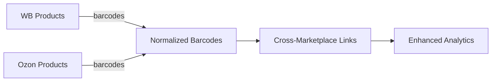

# 📋 DataFox SL - Comprehensive Project Index

> **Ultimate navigation guide** for the DataFox SL marketplace analytics platform

## 📖 Document Navigation

| **Section** | **Description** | **Primary Audience** |
|-------------|-----------------|---------------------|
| [📁 Project Structure](#-project-structure) | Directory organization and architecture | Developers, Architects |
| [🏗️ Core Components](#-core-components) | Main system modules and their functions | All Users |
| [📊 Database Schema](#-database-schema) | Data models and relationships | Data Analysts, Developers |
| [🎯 Key Features](#-key-features) | Feature overview by category | Product Managers, Users |
| [🔧 Development Guide](#-development-guide) | Development workflows and patterns | Developers |
| [📚 Documentation Matrix](#-documentation-matrix) | All documentation cross-referenced | All Users |

## 📁 Project Structure

### **Root Level**
```
datafox_sl/
├── 📱 app.py                    # Main Streamlit application
├── 🗂️ main.py                  # Alternative entry point
├── 📊 pyproject.toml           # UV/pip project configuration  
├── 📋 requirements.txt         # Python dependencies
├── ⚙️ config.example.json      # Configuration template
├── 🔐 config.json             # Active configuration (gitignored)
├── 📖 CLAUDE.md               # AI assistant development guide
└── 📖 README.md               # Project overview and quick start
```

### **Core Directories**

#### **📱 Application Layer**
```
pages/                         # Streamlit pages (emoji-prefixed)
├── 🏠 1_🏠_Главная.py         # Dashboard and overview
├── 🖇️ 2_🖇_Импорт_Отчетов_МП.py # Marketplace data import
├── ⚙️ 3_⚙️_Настройки.py        # System configuration  
├── 📖 4_📖_Просмотр_БД.py      # Database viewer
├── 🔎 5_🔎_Поиск_Между_МП.py   # Cross-marketplace search
└── ... (17 total pages)
```

#### **🛠️ Core Utilities**
```
utils/                         # Core business logic
├── 🔗 cross_marketplace_linker.py    # WB ↔ Ozon product linking
├── 🗄️ db_connection.py              # Database connection pooling
├── 📊 db_schema.py                  # Database schema management
├── 🎯 wb_recommendations.py         # WB recommendation engine
├── 🌟 rich_content_oz.py            # Rich content generation
└── ... (25+ utility modules)
```

#### **🗃️ Data Storage**
```
data/                          # Database files (gitignored)
├── 💾 database.duckdb         # Primary DuckDB database
├── 📊 datafox_sl.db          # Legacy SQLite (migration target)
└── 🗂️ marketplace_data.db    # Temporary database files
```

#### **📊 Marketplace Data**
```
marketplace_reports/           # Import data sources
├── 🛍️ ozon/                  # Ozon marketplace reports
│   ├── 📁 CustomFiles/       # User-uploaded analysis files
│   ├── 🔢 oz_products_category/ # Category-specific exports  
│   ├── 📄 oz_products.csv    # Product master data
│   ├── 📊 oz_orders.csv      # Order transaction data
│   └── 📈 oz_prices.xlsx     # Pricing information
└── 🛒 wb/                    # Wildberries marketplace reports  
    ├── 📦 products/          # Product characteristic files
    ├── 💰 wb_prices.xlsx     # WB pricing data
    └── 🎯 wb_recomm/         # Manual recommendation overrides
```

#### **📚 Documentation Hub**
```
project-docs/                 # Comprehensive documentation
├── 📋 overview.md            # Project overview and goals
├── 🏗️ tech-specs.md         # Technical specifications
├── 📖 user-guides/          # Step-by-step user documentation
├── 🔧 technical/            # Developer and architecture docs
└── 📊 data-structures/      # Database schema documentation
```

#### **🧪 Testing Framework**  
```
tests/                        # Comprehensive test suite
├── ⚙️ conftest.py           # Test configuration and fixtures
└── 🧪 unit/                 # Unit tests for core components
    ├── 🎯 test_recommendation_engine.py
    ├── 🌟 test_rich_content_processor.py
    └── ... (7 test modules)
```

## 🏗️ Core Components

### **🔗 Cross-Marketplace Integration**

| **Component** | **Purpose** | **Key Features** |
|---------------|-------------|------------------|
| `CrossMarketplaceLinker` | WB ↔ Ozon product linking via barcodes | Barcode normalization, position tracking, batch processing |
| `WBRecommendationEngine` | Find similar WB products using Ozon data | Similarity scoring, data enrichment, manual overrides |
| `RichContentProcessor` | Generate Ozon Rich Content using WB data | JSON generation, batch optimization, memory-safe processing |

### **🗄️ Database Management**

| **Component** | **Purpose** | **Key Features** |
|---------------|-------------|------------------|
| `db_connection.py` | Connection pooling and management | `@st.cache_resource` pooling, error handling, auto-reconnection |
| `db_schema.py` | Schema definition and management | Table creation, constraint management, migration support |
| `db_migration.py` | Database schema migrations | Version tracking, automated migrations, rollback support |
| `db_cleanup.py` | Data maintenance and optimization | Duplicate removal, orphaned data cleanup, performance optimization |

### **📊 Analytics & Reporting**

| **Component** | **Purpose** | **Key Features** |
|---------------|-------------|------------------|
| `analytic_report_helpers.py` | Excel report generation with data integration | Template merging, cross-marketplace data, formatting |
| `category_helpers.py` | Category analysis and comparison | Category mapping, discrepancy detection, standardization |
| `advanced_product_grouper.py` | Intelligent product grouping with rating compensation | Multi-criteria grouping, rating algorithms, manual overrides |

## 📊 Database Schema

### **🛍️ Ozon Tables**
| **Table** | **Purpose** | **Key Fields** | **Records** |
|-----------|-------------|---------------|-------------|  
| `oz_products` | Product master data | `oz_sku`, `oz_vendor_code`, `oz_fbo_stock` | ~50K-100K |
| `oz_category_products` | Category-enriched products | `oz_vendor_code`, `oz_brand`, `oz_category`, `color_name` | ~50K-100K |
| `oz_barcodes` | Product barcodes | `oz_vendor_code`, `barcode` (normalized) | ~200K-500K |
| `oz_orders` | Transaction data | `oz_sku`, `order_date`, `quantity`, `revenue` | ~500K-1M |
| `oz_card_rating` | Product ratings | `oz_vendor_code`, `rating`, `review_count` | ~50K |

### **🛒 Wildberries Tables** 
| **Table** | **Purpose** | **Key Fields** | **Records** |
|-----------|-------------|---------------|-------------|
| `wb_products` | Product characteristics | `wb_sku`, `wb_brand`, `wb_category`, `size` | ~200K-500K |
| `wb_prices` | Pricing information | `wb_sku`, `price`, `discount`, `final_price` | ~200K-500K |

### **🔗 Linking Strategy**


**Barcode Normalization Rules:**
- Position-based prioritization (first barcode = primary)
- Remove non-digit characters
- EAN-13 validation and completion  
- Duplicate detection and merging

## 🎯 Key Features

### **📈 Analytics & Reporting**
| **Feature** | **Page** | **Core Utility** | **Use Case** |
|-------------|----------|-----------------|--------------|
| Order Statistics | `6_📊_Статистика_Заказов_OZ.py` | SQL aggregation | Sales performance analysis |
| Analytic Reports | `8_📋_Аналитический_Отчет_OZ.py` | `analytic_report_helpers.py` | Executive reporting, Excel export |
| Category Comparison | `9_🔄_Сверка_Категорий_OZ.py` | `category_helpers.py` | Data quality validation |

### **🎯 Recommendations & Content**  
| **Feature** | **Page** | **Core Utility** | **Use Case** |
|-------------|----------|-----------------|--------------|
| Rich Content Generation | `11_🚧_Rich_Контент_OZ.py` | `rich_content_oz.py` | Ozon listing optimization |
| WB Recommendations | `16_🎯_Рекомендации_WB.py` | `wb_recommendations.py` | Similar product discovery |
| Advanced Product Grouping | `14_🎯_Улучшенная_Группировка_Товаров.py` | `advanced_product_grouper.py` | Inventory organization |

### **🔎 Search & Discovery**
| **Feature** | **Page** | **Core Utility** | **Use Case** |
|-------------|----------|-----------------|--------------|  
| Cross-Marketplace Search | `5_🔎_Поиск_Между_МП.py` | `cross_marketplace_linker.py` | Product matching across platforms |
| WB SKU Collection | `13_🔗_Сбор_WB_SKU_по_Озон.py` | `oz_to_wb_collector.py` | Automated SKU mapping |
| Card Problems Analysis | `12_🚨_Проблемы_Карточек_OZ.py` | Built-in analysis | Quality control |

### **⚙️ Data Management**
| **Feature** | **Page** | **Core Utility** | **Use Case** |
|-------------|----------|-----------------|--------------|
| Data Import | `2_🖇_Импорт_Отчетов_МП.py` | Multiple importers | Marketplace data ingestion |
| Database Viewer | `4_📖_Просмотр_БД.py` | `db_search_helpers.py` | Data exploration |
| Excel Tools | `15_📊_Объединение_Excel.py`, `17_📊_Дробление_Excel.py` | Built-in processing | File management |

## 🔧 Development Guide

### **🚀 Quick Start Development**
```bash
# Setup environment
pip install -r requirements.txt

# Start development server
streamlit run app.py --server.runOnSave true

# Run tests
python -m pytest tests/ -v

# Database operations
python -c "from utils.db_schema import setup_database; setup_database()"
```

### **🧩 Key Development Patterns**

#### **Database Operations**
```python
# Always use connection pooling
@st.cache_resource
def get_database_connection():
    return connect_db()

# Parameterized queries for security
results = conn.execute("SELECT * FROM table WHERE field = ?", [value]).fetchall()
```

#### **Cross-Marketplace Linking**
```python
from utils.cross_marketplace_linker import CrossMarketplaceLinker

linker = CrossMarketplaceLinker(db_conn)
linked_products = linker.find_linked_products(
    oz_vendor_codes=['CODE1', 'CODE2'], 
    include_wb_data=True
)
```

#### **Memory Management**
```python
# Clear heavy session state
if 'heavy_data' in st.session_state:
    del st.session_state.heavy_data
    st.rerun()

# Use batch processing
for batch in process_in_batches(data, batch_size=1000):
    process_batch(batch)
```

### **🔍 Testing Strategy**

#### **Test Categories**
| **Type** | **Location** | **Coverage** | **Purpose** |
|----------|--------------|--------------|-------------|
| Unit Tests | `tests/unit/` | Core utilities | Component validation |
| Integration Tests | `tests/integration/` | Database operations | System integration |
| Performance Tests | `tests/performance/` | Large datasets | Scalability validation |

#### **Test Data Sources**
- **Sample Data**: `marketplace_reports/ozon/CustomFiles/`
- **Test Fixtures**: `tests/conftest.py`
- **Mock Data**: Programmatically generated test datasets

### **📊 Performance Guidelines**

#### **Database Optimization**
- Use `LIMIT` for UI previews
- Implement query result caching  
- Batch operations for >1000 records
- Monitor connection pooling efficiency

#### **Memory Management**
- Clear session state after heavy operations
- Use generators for large exports
- Implement streaming for files >50MB
- Monitor memory usage during development

#### **UI Responsiveness**
- Add `st.spinner()` for long operations
- Use `st.progress()` for batch processing
- Implement `st.empty()` for dynamic updates
- Add pagination for large result sets

## 📚 Documentation Matrix

### **📖 User Documentation**
| **Document** | **Audience** | **Purpose** | **Status** |
|--------------|--------------|-------------|------------|
| [📄 README.md](../README.md) | All Users | Project overview, quick start | ✅ Current |
| [🏠 Home Dashboard Guide](user-guides/home-dashboard.md) | End Users | Dashboard navigation | ✅ Current |
| [🖇 Data Import Guide](user-guides/data-import.md) | Data Operators | Import workflows | ✅ Current |
| [🔎 Cross-Marketplace Search](user-guides/cross-marketplace-search.md) | Analysts | Product linking | ✅ Current |
| [🎯 WB Recommendations Guide](user-guides/wb-recommendations.md) | Product Managers | Recommendation system | ✅ Current |
| [🌟 Rich Content Guide](user-guides/rich-content.md) | Content Creators | Content generation | ✅ Current |

### **🔧 Technical Documentation**
| **Document** | **Audience** | **Purpose** | **Status** |
|--------------|--------------|-------------|------------|
| [🏗 Architecture Overview](technical/architecture-overview.md) | Architects | System design | ✅ Current |
| [🔗 Cross-Marketplace Linker](technical/implementation/cross-marketplace-linker.md) | Developers | Linking algorithm | ✅ Current |
| [🎯 WB Recommendations Implementation](technical/implementation/wb-recommendations-implementation.md) | Developers | Recommendation engine | ✅ Current |
| [📊 Database Schema](data-structures/db_schema.md) | Database Engineers | Schema design | ✅ Current |
| [⚡ Performance Optimization](technical/rich-content-oz-memory-optimization.md) | DevOps | System optimization | ✅ Current |

### **📋 Process Documentation**
| **Document** | **Audience** | **Purpose** | **Status** |
|--------------|--------------|-------------|------------|
| [📈 Project Roadmap](project-management/planning/improvement-roadmap.md) | Product Managers | Feature planning | ✅ Current |
| [🔄 Migration Status](migration-status.md) | DevOps | System migrations | ✅ Current |
| [📊 Analysis Reports](project-management/reports/analysis-report.md) | Management | System insights | ✅ Current |
| [🚀 Changelog](project-management/changelog.md) | All Users | Release history | ✅ Current |

### **🛠 Development Resources**
| **Resource** | **Purpose** | **Access** |
|--------------|-------------|------------|
| [🔧 CLAUDE.md](../CLAUDE.md) | AI assistant guidance | Development environment |
| [📋 Requirements](requirements.md) | System requirements | Project root |
| [⚙️ Config Template](../config.example.json) | Configuration setup | Project root |
| [🧪 Test Suite](../tests/) | Quality assurance | Development environment |

## 🎯 Feature Index by Business Value

### **🔥 High-Impact Features**
1. **🎯 WB Recommendations** - Revolutionary similar product discovery
2. **🔗 Cross-Marketplace Linking** - Foundation for all integrations  
3. **🌟 Rich Content Generation** - Automated listing optimization
4. **📊 Analytics Reports** - Executive decision support

### **⚡ Productivity Boosters**
1. **📖 Database Viewer** - Universal data exploration
2. **🖇 Batch Import System** - Automated data ingestion
3. **📊 Excel Tools** - File processing automation
4. **🎯 Advanced Product Grouping** - Inventory organization

### **🛡️ Quality Control** 
1. **🚨 Card Problems Detection** - Data quality validation
2. **🔄 Category Comparison** - Consistency checking
3. **🔍 Cross-Platform Search** - Manual verification tools
4. **📊 Order Statistics** - Performance monitoring

---

## 📞 Support & Navigation

### **🔍 Quick Find**
- **Need to understand a feature?** → Check [📖 User Guides](user-guides/)
- **Developing or debugging?** → See [🔧 Technical Docs](technical/)
- **Planning or roadmapping?** → Review [📋 Project Management](project-management/)
- **Database questions?** → Explore [📊 Data Structures](data-structures/)

### **🚨 Common Issues & Solutions**
| **Issue** | **Solution** | **Reference** |
|-----------|--------------|---------------|
| **Database connection fails** | Check config.json, restart Streamlit | [⚙️ Settings Guide](user-guides/settings.md) |
| **Memory errors during processing** | Enable memory-safe mode, reduce batch size | [⚡ Performance Guide](technical/rich-content-oz-memory-optimization.md) |
| **Cross-linking not working** | Verify barcode data quality, check normalization | [🔗 Linking Guide](technical/implementation/cross-marketplace-linker.md) |
| **WB recommendations low quality** | Check manual overrides, adjust scoring weights | [🎯 WB Debug Guide](technical/wb-recommendations-debug-guide.md) |

### **📈 Success Metrics**
- **Cross-Linking Accuracy**: 85-95% (varies by data quality)
- **Processing Speed**: 1-3 seconds per product
- **Data Coverage**: 70-90% for linked products  
- **System Uptime**: >99% (local deployment)

---

*📋 Project Index | Last Updated: August 2025 | Version: 2.1.0*  
*🎯 New Features: WB Recommendations Engine, Advanced Analytics, Memory Optimization*