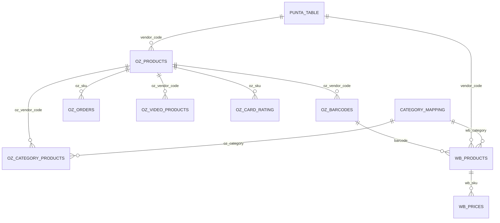

# 🔗 Связи в базе данных DataFox SL

> Диаграмма отношений между таблицами и ключевые связи

## 🎯 Обзор связей

База данных DataFox SL построена вокруг связывания товаров между маркетплейсами Ozon и Wildberries через штрихкоды и артикулы.

## 🗄️ Схема связей

### Центральные сущности



### Ключевые связи

#### **1. Связь через штрихкоды (основная)**
```sql
-- Поиск соответствий OZ ↔ WB через штрихкоды
SELECT 
    oz.oz_vendor_code,
    oz.oz_sku,
    wb.wb_sku,
    wb.wb_brand
FROM oz_barcodes ozb
JOIN oz_products oz ON oz.oz_vendor_code = ozb.oz_vendor_code  
JOIN wb_products wb ON wb.wb_barcodes LIKE '%' || ozb.oz_barcode || '%'
```

#### **2. Связь через артикулы (дополнительная)**
```sql
-- Поиск по схожести артикулов
SELECT 
    oz.oz_vendor_code,
    wb.wb_sku,
    SIMILARITY(oz.oz_vendor_code, CAST(wb.wb_sku AS VARCHAR)) as similarity_score
FROM oz_products oz, wb_products wb
WHERE SIMILARITY(oz.oz_vendor_code, CAST(wb.wb_sku AS VARCHAR)) > 0.8
```

#### **3. Связь через справочник Punta**
```sql
-- Связывание через единый справочник
SELECT 
    p.vendor_code,
    oz.oz_sku,
    wb.wb_sku
FROM punta_table p
LEFT JOIN oz_products oz ON oz.oz_vendor_code = p.vendor_code
LEFT JOIN wb_products wb ON CAST(wb.wb_sku AS VARCHAR) = p.vendor_code
```

## 📊 Детальная схема таблиц

### Основные таблицы Ozon

#### **oz_products** (Центральная таблица товаров)
```sql
CREATE TABLE oz_products (
    oz_vendor_code VARCHAR PRIMARY KEY,  -- Артикул продавца
    oz_product_id BIGINT,                -- Ozon Product ID
    oz_sku BIGINT,                       -- SKU в системе Ozon
    oz_brand VARCHAR,                    -- Бренд
    oz_product_status VARCHAR,           -- Статус товара
    oz_product_visible VARCHAR,          -- Видимость на Ozon
    oz_hiding_reasons VARCHAR,           -- Причины скрытия
    oz_fbo_stock INTEGER,                -- Остатки FBO
    oz_actual_price DOUBLE               -- Текущая цена
);
```

#### **oz_barcodes** (Штрихкоды для связи)
```sql
CREATE TABLE oz_barcodes (
    oz_vendor_code VARCHAR,              -- → oz_products.oz_vendor_code
    oz_product_id BIGINT,               -- → oz_products.oz_product_id  
    oz_barcode VARCHAR,                 -- Штрихкод (ключ для связи с WB)
    PRIMARY KEY (oz_vendor_code, oz_barcode)
);
```

#### **oz_orders** (Заказы)
```sql
CREATE TABLE oz_orders (
    oz_order_number VARCHAR,
    oz_shipment_number VARCHAR,
    oz_accepted_date DATE,
    order_status VARCHAR,
    oz_sku BIGINT,                      -- → oz_products.oz_sku
    oz_vendor_code VARCHAR              -- → oz_products.oz_vendor_code
);
```

#### **oz_category_products** (Детальные характеристики)
```sql
CREATE TABLE oz_category_products (
    oz_vendor_code VARCHAR,             -- → oz_products.oz_vendor_code
    product_name VARCHAR,
    oz_actual_price NUMERIC,
    oz_price_before_discount NUMERIC,
    vat_percent INTEGER,
    oz_sku VARCHAR,
    barcode VARCHAR,                    -- Дополнительный ключ для связи
    -- ... множество характеристик товара ...
    oz_brand VARCHAR,
    color VARCHAR,
    russian_size VARCHAR,
    material VARCHAR,
    error TEXT,                         -- Ошибки импорта
    warning TEXT                        -- Предупреждения
);
```

### Основные таблицы Wildberries

#### **wb_products** (Товары WB)
```sql
CREATE TABLE wb_products (
    wb_sku INTEGER PRIMARY KEY,         -- Артикул WB
    wb_category VARCHAR,                -- Категория продавца
    wb_brand VARCHAR,                   -- Бренд
    wb_barcodes VARCHAR,                -- Штрихкоды через ; (ключ для связи)
    wb_size INTEGER                     -- Размер
);
```

#### **wb_prices** (Цены и остатки)
```sql
CREATE TABLE wb_prices (
    wb_sku INTEGER,                     -- → wb_products.wb_sku
    wb_fbo_stock INTEGER,               -- Остатки на складе
    wb_full_price INTEGER,              -- Полная цена
    wb_discount INTEGER                 -- Текущая скидка %
);
```

### Системные таблицы

#### **punta_table** (Универсальный справочник)
```sql
CREATE TABLE punta_table (
    -- Динамическая схема, определяется содержимым Google Sheets
    vendor_code VARCHAR,                -- Общий артикул
    product_name VARCHAR,               -- Название товара
    category VARCHAR,                   -- Категория
    brand VARCHAR,                      -- Бренд
    -- ... другие поля в зависимости от справочника ...
);
```

#### **category_mapping** (Соответствия категорий)
```sql
CREATE TABLE category_mapping (
    id INTEGER PRIMARY KEY,
    wb_category VARCHAR,                -- Категория в WB
    oz_category VARCHAR,                -- Соответствующая категория в Ozon
    mapping_type VARCHAR,               -- manual|automatic|suggested
    confidence_score FLOAT,             -- Уверенность в соответствии
    created_date DATE,
    updated_date DATE
);
```

## 🔍 Алгоритмы связывания

### Поиск связанных товаров

#### **Алгоритм 1: Точное совпадение штрихкодов**
```python
def find_exact_barcode_matches():
    """
    Находит товары с точным совпадением штрихкодов
    """
    query = """
    SELECT DISTINCT
        ozb.oz_vendor_code,
        ozb.oz_barcode,
        wb.wb_sku,
        wb.wb_brand,
        'exact_barcode' as match_type,
        1.0 as confidence
    FROM oz_barcodes ozb
    JOIN wb_products wb ON wb.wb_barcodes LIKE '%' || ozb.oz_barcode || '%'
    WHERE LENGTH(ozb.oz_barcode) >= 8  -- Исключаем короткие коды
    """
```

#### **Алгоритм 2: Нормализация WB штрихкодов**
```python
def normalize_wb_barcodes():
    """
    WB хранит штрихкоды как строку через ;
    Создаем нормализованную таблицу для поиска
    """
    query = """
    WITH wb_barcodes_normalized AS (
        SELECT 
            wb_sku,
            TRIM(barcode_part) as barcode
        FROM wb_products wb,
        UNNEST(string_split(wb.wb_barcodes, ';')) as t(barcode_part)
        WHERE barcode_part IS NOT NULL 
        AND LENGTH(TRIM(barcode_part)) >= 8
    )
    SELECT 
        wbn.wb_sku,
        wbn.barcode,
        ozb.oz_vendor_code
    FROM wb_barcodes_normalized wbn
    JOIN oz_barcodes ozb ON ozb.oz_barcode = wbn.barcode
    """
```

#### **Алгоритм 3: Similarity артикулов**
```python
def find_vendor_code_similarity():
    """
    Поиск по схожести артикулов через edit distance
    """
    query = """
    SELECT 
        oz.oz_vendor_code,
        wb.wb_sku,
        LEVENSHTEIN(oz.oz_vendor_code, CAST(wb.wb_sku AS VARCHAR)) as edit_distance,
        (1.0 - LEVENSHTEIN(oz.oz_vendor_code, CAST(wb.wb_sku AS VARCHAR)) 
         / GREATEST(LENGTH(oz.oz_vendor_code), LENGTH(CAST(wb.wb_sku AS VARCHAR)))) as similarity
    FROM oz_products oz, wb_products wb
    WHERE LENGTH(oz.oz_vendor_code) >= 4
    AND LENGTH(CAST(wb.wb_sku AS VARCHAR)) >= 4
    HAVING similarity > 0.7
    ORDER BY similarity DESC
    """
```

### Cards Matcher связи

#### **Группировка похожих карточек**
```sql
-- Поиск дублей в рамках одного маркетплейса
WITH oz_groups AS (
    SELECT 
        oz_brand,
        REGEXP_REPLACE(product_name, '\s+', ' ') as normalized_name,
        color,
        russian_size,
        COUNT(*) as variants_count,
        STRING_AGG(oz_vendor_code, ';') as vendor_codes
    FROM oz_category_products
    WHERE oz_brand IS NOT NULL
    GROUP BY oz_brand, normalized_name, color, russian_size
    HAVING COUNT(*) > 1
)
SELECT * FROM oz_groups
ORDER BY variants_count DESC;
```

## 📈 Аналитические запросы

### Кросс-маркетплейс аналитика

#### **Покрытие товаров между маркетплейсами**
```sql
WITH coverage_stats AS (
    SELECT 
        COUNT(DISTINCT oz.oz_vendor_code) as total_oz_products,
        COUNT(DISTINCT wb.wb_sku) as total_wb_products,
        COUNT(DISTINCT CASE 
            WHEN wb.wb_sku IS NOT NULL THEN oz.oz_vendor_code 
        END) as matched_oz_products,
        COUNT(DISTINCT CASE 
            WHEN oz.oz_vendor_code IS NOT NULL THEN wb.wb_sku 
        END) as matched_wb_products
    FROM oz_products oz
    FULL OUTER JOIN (
        -- Подзапрос связей через штрихкоды
        SELECT DISTINCT ozb.oz_vendor_code, wb.wb_sku
        FROM oz_barcodes ozb
        JOIN wb_products wb ON wb.wb_barcodes LIKE '%' || ozb.oz_barcode || '%'
    ) matches ON matches.oz_vendor_code = oz.oz_vendor_code
    LEFT JOIN wb_products wb ON wb.wb_sku = matches.wb_sku
)
SELECT 
    total_oz_products,
    total_wb_products,
    matched_oz_products,
    matched_wb_products,
    ROUND(matched_oz_products * 100.0 / total_oz_products, 2) as oz_coverage_pct,
    ROUND(matched_wb_products * 100.0 / total_wb_products, 2) as wb_coverage_pct
FROM coverage_stats;
```

#### **Анализ заказов с кросс-маркетплейс данными**
```sql
SELECT 
    DATE_TRUNC('month', oz_accepted_date) as order_month,
    COUNT(*) as total_orders,
    COUNT(DISTINCT wb.wb_sku) as orders_with_wb_match,
    SUM(oz.oz_actual_price) as total_oz_revenue,
    AVG(wb.wb_full_price) as avg_wb_price,
    AVG(oz.oz_actual_price) as avg_oz_price
FROM oz_orders ord
JOIN oz_products oz ON oz.oz_sku = ord.oz_sku
LEFT JOIN (
    SELECT DISTINCT ozb.oz_vendor_code, wb.wb_sku, wb.wb_full_price
    FROM oz_barcodes ozb
    JOIN wb_products wb ON wb.wb_barcodes LIKE '%' || ozb.oz_barcode || '%'
    JOIN wb_prices wbp ON wbp.wb_sku = wb.wb_sku
) wb ON wb.oz_vendor_code = oz.oz_vendor_code
WHERE oz_accepted_date >= '2024-01-01'
GROUP BY DATE_TRUNC('month', oz_accepted_date)
ORDER BY order_month;
```

## 🔧 Индексы и оптимизация

### Рекомендуемые индексы

```sql
-- Основные индексы для связей
CREATE INDEX idx_oz_products_vendor_code ON oz_products(oz_vendor_code);
CREATE INDEX idx_oz_products_sku ON oz_products(oz_sku);
CREATE INDEX idx_oz_barcodes_vendor_code ON oz_barcodes(oz_vendor_code);
CREATE INDEX idx_oz_barcodes_barcode ON oz_barcodes(oz_barcode);

CREATE INDEX idx_wb_products_sku ON wb_products(wb_sku);
CREATE INDEX idx_wb_prices_sku ON wb_prices(wb_sku);

-- Составные индексы для частых запросов
CREATE INDEX idx_oz_orders_sku_date ON oz_orders(oz_sku, oz_accepted_date);
CREATE INDEX idx_oz_category_vendor_brand ON oz_category_products(oz_vendor_code, oz_brand);

-- Индексы для текстового поиска  
CREATE INDEX idx_oz_products_brand ON oz_products(oz_brand);
CREATE INDEX idx_wb_products_brand ON wb_products(wb_brand);
```

### Оптимизация запросов

#### **Кеширование связей**
```sql
-- Материализованное представление связей
CREATE VIEW cross_marketplace_links AS
SELECT DISTINCT
    ozb.oz_vendor_code,
    ozb.oz_barcode,
    wb.wb_sku,
    'barcode_match' as link_type,
    1.0 as confidence
FROM oz_barcodes ozb
JOIN wb_products wb ON wb.wb_barcodes LIKE '%' || ozb.oz_barcode || '%'

UNION ALL

SELECT DISTINCT
    oz.oz_vendor_code,
    NULL as oz_barcode,
    CAST(oz.oz_vendor_code AS INTEGER) as wb_sku,
    'vendor_code_match' as link_type,
    0.8 as confidence
FROM oz_products oz
WHERE oz.oz_vendor_code ~ '^[0-9]+$'
AND EXISTS(SELECT 1 FROM wb_products wb WHERE wb.wb_sku = CAST(oz.oz_vendor_code AS INTEGER));
```

## 🚨 Ограничения и проблемы

### Известные проблемы связей

#### **1. Множественные штрихкоды в WB**
```python
# WB хранит: "123456;789012;555444"
# Требует нормализации для поиска
wb_barcodes_normalized = wb_barcodes.split(';')
```

#### **2. Неточности в артикулах**
```python
# Примеры проблем:
# OZ: "ABC-123-XL" vs WB: "ABC123XL"  
# OZ: "12345" vs WB: 12345 (string vs int)
```

#### **3. Дублирование штрихкодов**
```sql
-- Один штрихкод может быть у нескольких товаров
SELECT oz_barcode, COUNT(*) as count
FROM oz_barcodes 
GROUP BY oz_barcode 
HAVING COUNT(*) > 1;
```

### Стратегии решения

#### **Приоритизация алгоритмов:**
1. **Точное совпадение штрихкодов** (confidence: 1.0)
2. **Совпадение артикулов** (confidence: 0.9)  
3. **Схожесть названий + бренд** (confidence: 0.7)
4. **Fuzzy matching артикулов** (confidence: 0.5-0.8)

#### **Валидация связей:**
```python
def validate_cross_platform_link(oz_vendor_code, wb_sku):
    """Валидация связи между платформами"""
    # 1. Проверка брендов
    if oz_brand.lower() != wb_brand.lower():
        confidence -= 0.2
    
    # 2. Проверка цен (не должны сильно отличаться)
    price_diff = abs(oz_price - wb_price) / max(oz_price, wb_price)
    if price_diff > 0.5:
        confidence -= 0.3
    
    # 3. Проверка категорий
    if not category_mapping_exists(oz_category, wb_category):
        confidence -= 0.1
    
    return confidence > 0.5
```

---

## 📝 Метаданные

**Последнее обновление**: 2024-12-19  
**Версия схемы**: 1.2.0  
**Статус**: Актуальный  

**Связанные документы**:
- [Схема базы данных](schemas/db_schema.md)
- [Database Utils API](../technical/api/database-utils.md)
- [Архитектура системы](../technical/architecture-overview.md)

*Схема связей отражает текущие алгоритмы связывания между Ozon и Wildberries.* 