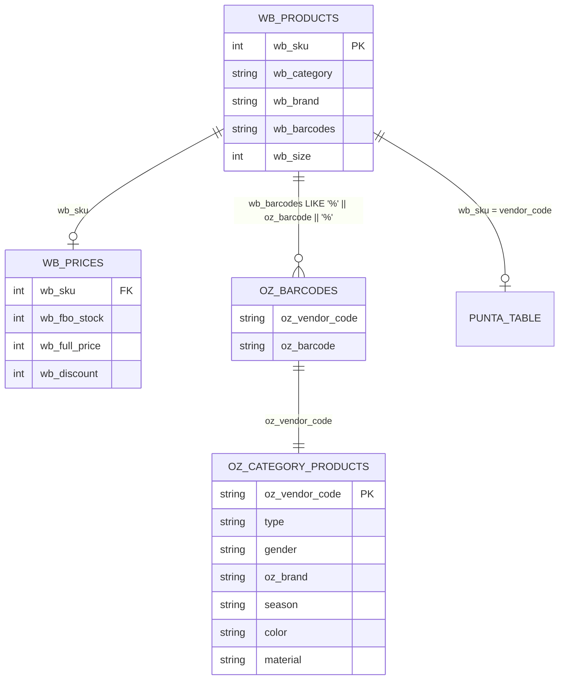

# 🎯 WB Recommendations - Technical Implementation

> **Техническая документация**: Реализация алгоритма рекомендаций для WB товаров

## 📋 Обзор архитектуры

### Общая концепция
Система WB рекомендаций адаптирует алгоритм из Rich Content OZ для работы с WB товарами. Основная идея заключается в обогащении WB товаров характеристиками из связанных Ozon товаров через штрихкоды и применении алгоритма similarity scoring.

### Архитектурные компоненты

```
┌─────────────────────────────────────────────────────────────────┐
│                     WB Recommendations Architecture              │
├─────────────────────────────────────────────────────────────────┤
│  🎯 WBRecommendationProcessor (Orchestrator)                   │
│  ├── 📊 WBRecommendationEngine (Core Algorithm)                │
│  ├── 🔍 WBDataCollector (Data Enrichment)                      │
│  └── ⚙️ WBScoringConfig (Configuration)                        │
├─────────────────────────────────────────────────────────────────┤
│  🔗 CrossMarketplaceLinker (WB ↔ Ozon Linking)                 │
│  ├── oz_barcodes ↔ wb_products (штрихкоды)                     │
│  └── punta_table (дополнительные данные)                       │
├─────────────────────────────────────────────────────────────────┤
│  🗄️ Data Sources                                                │
│  ├── wb_products (базовые данные WB)                           │
│  ├── wb_prices (цены и остатки)                                │
│  ├── oz_category_products (характеристики Ozon)                │
│  └── punta_table (справочные данные)                           │
└─────────────────────────────────────────────────────────────────┘
```

## 🧩 Модуль utils/wb_recommendations.py

### Основные классы

#### 1. WBProductInfo
```python
@dataclass
class WBProductInfo:
    """Модель данных WB товара с обогащенными характеристиками"""
    
    # Основные поля WB
    wb_sku: str
    wb_category: Optional[str] = None
    wb_brand: Optional[str] = None
    wb_size: Optional[int] = None
    wb_barcodes: Optional[str] = None
    
    # Поля из wb_prices
    wb_fbo_stock: int = 0
    wb_full_price: Optional[int] = None
    wb_discount: Optional[int] = None
    
    # Обогащенные характеристики из Ozon
    enriched_type: Optional[str] = None
    enriched_gender: Optional[str] = None
    enriched_brand: Optional[str] = None
    enriched_season: Optional[str] = None
    enriched_color: Optional[str] = None
    enriched_material: Optional[str] = None
    enriched_fastener_type: Optional[str] = None
    
    # Punta данные
    punta_material_short: Optional[str] = None
    punta_new_last: Optional[str] = None
    punta_mega_last: Optional[str] = None
    punta_best_last: Optional[str] = None
```

**Ключевые методы:**
- `has_enriched_data()`: Проверка наличия обязательных обогащенных данных
- `get_enrichment_score()`: Оценка качества обогащения (0-1)
- `get_effective_*()`: Получение эффективных значений с приоритетом

#### 2. WBScoringConfig
```python
@dataclass
class WBScoringConfig:
    """Конфигурация системы оценки схожести"""
    
    # Базовые параметры
    base_score: int = 100
    max_score: int = 500
    
    # Веса для различных параметров
    exact_size_weight: int = 100
    season_match_bonus: int = 80
    color_match_bonus: int = 40
    material_match_bonus: int = 40
    
    # Колодки
    mega_last_bonus: int = 90
    best_last_bonus: int = 70
    new_last_bonus: int = 50
    
    # Остатки и цены
    stock_high_bonus: int = 40
    price_similarity_bonus: int = 20
    
    # Качество обогащения
    enrichment_quality_bonus: int = 30
    
    # Лимиты
    max_recommendations: int = 20
    min_recommendations: int = 5
    min_score_threshold: float = 50.0
```

**Предустановленные конфигурации:**
- `balanced`: Сбалансированный подход
- `size_focused`: Фокус на размерах
- `price_focused`: Фокус на цене
- `quality_focused`: Фокус на качестве обогащения
- `conservative`: Консервативный подход

#### 3. WBDataCollector
```python
class WBDataCollector:
    """Класс для сбора и обогащения данных WB товаров"""
    
    def __init__(self, db_conn):
        self.db_conn = db_conn
        self.linker = CrossMarketplaceLinker(db_conn)
    
    def get_wb_product_info(self, wb_sku: str) -> Optional[WBProductInfo]:
        """Получение полной информации о WB товаре с обогащением"""
        
    def find_wb_candidates(self, source_product: WBProductInfo) -> List[WBProductInfo]:
        """Поиск кандидатов WB товаров для рекомендаций"""
```

**Процесс обогащения:**
1. Получение базовых данных WB
2. Поиск связанных Ozon товаров через штрихкоды
3. Извлечение характеристик из Ozon
4. Обогащение данными из punta_table
5. Нормализация и валидация данных

**Стратегии обогащения:**
- **Наиболее популярные**: Для каждой характеристики выбирается наиболее часто встречающееся значение среди связанных Ozon товаров
- **Приоритет источников**: Ozon → Punta → WB базовые данные

#### 4. WBRecommendationEngine
```python
class WBRecommendationEngine:
    """Основной движок рекомендаций WB товаров"""
    
    def find_similar_wb_products(self, wb_sku: str) -> List[WBRecommendation]:
        """Основной метод поиска похожих WB товаров"""
        
    def calculate_similarity_score(self, source: WBProductInfo, candidate: WBProductInfo) -> float:
        """Вычисление score схожести между товарами"""
```

**Алгоритм similarity scoring:**

```python
def calculate_similarity_score(self, source, candidate):
    score = config.base_score  # 100
    
    # Размеры - диапазон размеров (критический)
    score += self._calculate_size_score(source, candidate)
    
    # Сезонность
    score += self._calculate_season_score(source, candidate)
    
    # Дополнительные характеристики
    score += self._calculate_color_score(source, candidate)
    score += self._calculate_material_score(source, candidate)
    score += self._calculate_fastener_score(source, candidate)
    
    # Колодки
    last_score = self._calculate_last_score(source, candidate)
    score += last_score
    
    # Штраф за отсутствие совпадения колодки
    if last_score == 0:
        score *= config.no_last_penalty
    
    # Остатки и цена
    score += self._calculate_stock_score(candidate)
    score += self._calculate_price_score(source, candidate)
    
    # Качество обогащения
    score += self._calculate_enrichment_score(candidate)
    
    return min(score, config.max_score)
```

### Улучшенный алгоритм размеров

**Ключевая особенность:** Вместо сравнения одного размера, алгоритм работает с диапазонами размеров товаров.

**Принцип работы:**
1. Каждый wb_sku может иметь несколько размеров в таблице wb_products
2. Собираются все размеры для товара (например, [33, 34, 35, 36, 37, 38, 39, 40])
3. Вычисляется пересечение размеров между исходным и кандидатом
4. Оценка зависит от процента пересечения

**Примеры оценки:**
```python
# Исходный товар: размеры 33-40 (8 размеров)
# Кандидат: размеры 35-42 (8 размеров)
# Пересечение: 35-40 (6 размеров)
# Процент: 6/8 = 75%

def _calculate_size_score(self, source, candidate):
    overlap_percentage = source.calculate_size_overlap_percentage(candidate)
    
    if overlap_percentage >= 0.8:      # 80%+ → +40 баллов
        return config.exact_size_weight
    elif overlap_percentage >= 0.4:    # 40-80% → +20 баллов
        return config.close_size_weight
    elif overlap_percentage > 0:       # 1-40% → пропорционально
        return int(config.close_size_weight * overlap_percentage * 2)
    else:                             # 0% → штраф -50
        return config.size_mismatch_penalty
```

**Преимущества:**
- Учитывает реальную структуру данных WB
- Более точная оценка совместимости размеров
- Гибкая система баллов в зависимости от пересечения
- Поддержка товаров с широким диапазоном размеров

#### 5. WBRecommendationProcessor
```python
class WBRecommendationProcessor:
    """Главный класс-оркестратор для обработки WB рекомендаций"""
    
    def process_single_wb_product(self, wb_sku: str) -> WBProcessingResult:
        """Обработка одного WB товара"""
        
    def process_batch(self, wb_skus: List[str], progress_callback: Optional[Callable] = None) -> WBBatchResult:
        """Пакетная обработка WB товаров"""
        
    def get_statistics(self) -> Dict[str, Any]:
        """Получение статистики по WB товарам"""
```

## 🔗 Интеграция с существующими системами

### CrossMarketplaceLinker
Использует существующий модуль для связывания WB ↔ Ozon:

```python
# В WBDataCollector._enrich_with_ozon_data()
linked_oz = self.linker.link_wb_to_oz([product_info.wb_sku])
```

### SQL-запросы для обогащения

**Получение связанных Ozon характеристик:**
```sql
SELECT DISTINCT
    ocp.oz_vendor_code,
    ocp.type,
    ocp.gender,
    ocp.oz_brand,
    ocp.season,
    ocp.color,
    ocp.material,
    ocp.fastener_type
FROM oz_category_products ocp
JOIN oz_products op ON ocp.oz_vendor_code = op.oz_vendor_code
WHERE op.oz_sku IN ({oz_skus})
AND ocp.type IS NOT NULL
AND ocp.gender IS NOT NULL
AND ocp.oz_brand IS NOT NULL
```

**Поиск WB кандидатов:**
```sql
SELECT DISTINCT
    wb.wb_sku,
    wb.wb_category,
    wb.wb_brand,
    wb.wb_size,
    wb.wb_barcodes,
    COALESCE(wp.wb_fbo_stock, 0) as wb_fbo_stock,
    wp.wb_full_price,
    wp.wb_discount
FROM wb_products wb
LEFT JOIN wb_prices wp ON wb.wb_sku = wp.wb_sku
WHERE wb.wb_sku IN (
    SELECT DISTINCT wb2.wb_sku
    FROM wb_products wb2
    JOIN oz_barcodes ozb ON wb2.wb_barcodes LIKE '%' || ozb.oz_barcode || '%'
    JOIN oz_category_products ocp ON ozb.oz_vendor_code = ocp.oz_vendor_code
    WHERE ocp.type = ?
    AND ocp.gender = ?
    AND ocp.oz_brand = ?
    AND wb2.wb_sku != ?
)
AND COALESCE(wp.wb_fbo_stock, 0) > 0
```

## 📊 Страница 16 - UI Implementation

### Структура файла pages/16_🎯_Рекомендации_WB.py

```python
# Основные компоненты UI
def render_scoring_config_ui() -> WBScoringConfig:
    """Отрисовка UI для конфигурации алгоритма"""

def parse_wb_skus(input_text: str) -> List[str]:
    """Парсинг списка WB SKU из текста"""

def render_wb_skus_input() -> List[str]:
    """Отрисовка UI для ввода WB SKU"""

def render_batch_results(batch_result: WBBatchResult):
    """Отрисовка результатов пакетной обработки"""

def create_recommendations_table(batch_result: WBBatchResult) -> pd.DataFrame:
    """Создание итоговой таблицы рекомендаций"""
```

### Состояние сессии
```python
if 'wb_recommendation_processor' not in st.session_state:
    st.session_state.wb_recommendation_processor = None

if 'wb_batch_result' not in st.session_state:
    st.session_state.wb_batch_result = None

if 'wb_skus_input' not in st.session_state:
    st.session_state.wb_skus_input = ""
```

### Обработка прогресса
```python
def progress_callback(current: int, total: int, message: str):
    progress = current / total
    progress_bar.progress(progress)
    status_text.text(f"Обработано {current}/{total}: {message}")

batch_result = processor.process_batch(wb_skus, progress_callback)
```

## 🗄️ Схема данных

### Ключевые таблицы

**wb_products** (основная таблица WB)
```sql
CREATE TABLE wb_products (
    wb_sku INTEGER PRIMARY KEY,
    wb_category VARCHAR,
    wb_brand VARCHAR,
    wb_barcodes VARCHAR,  -- Ключ для связи с Ozon
    wb_size INTEGER
);
```

**wb_prices** (цены и остатки)
```sql
CREATE TABLE wb_prices (
    wb_sku INTEGER REFERENCES wb_products(wb_sku),
    wb_fbo_stock INTEGER,
    wb_full_price INTEGER,
    wb_discount INTEGER
);
```

**oz_category_products** (источник характеристик)
```sql
CREATE TABLE oz_category_products (
    oz_vendor_code VARCHAR,
    type VARCHAR,           -- Обязательное поле
    gender VARCHAR,         -- Обязательное поле
    oz_brand VARCHAR,       -- Обязательное поле
    season VARCHAR,
    color VARCHAR,
    material VARCHAR,
    fastener_type VARCHAR,
    -- ... другие характеристики
);
```

**oz_barcodes** (связующая таблица)
```sql
CREATE TABLE oz_barcodes (
    oz_vendor_code VARCHAR,
    oz_product_id BIGINT,
    oz_barcode VARCHAR      -- Связь с wb_products.wb_barcodes
);
```

### Связи между таблицами



## ⚡ Оптимизация производительности

### Кэширование
```python
# В WBDataCollector
@st.cache_data(ttl=300)  # 5 минут
def get_wb_product_info(_self, wb_sku: str) -> Optional[WBProductInfo]:
    """Кэшированное получение данных WB товара"""
```

### Пакетная обработка
```python
def process_batch(self, wb_skus: List[str], progress_callback: Optional[Callable] = None):
    """Оптимизированная пакетная обработка"""
    
    # Обработка по частям для избежания блокировки UI
    for i, wb_sku in enumerate(wb_skus):
        result = self.process_single_wb_product(wb_sku)
        
        # Обновление прогресса каждые 10 элементов
        if i % 10 == 0 and progress_callback:
            progress_callback(i + 1, len(wb_skus), f"Обработан {wb_sku}")
```

### Оптимизация SQL-запросов
```sql
-- Индексы для ускорения поиска
CREATE INDEX idx_wb_products_barcodes ON wb_products(wb_barcodes);
CREATE INDEX idx_oz_barcodes_barcode ON oz_barcodes(oz_barcode);
CREATE INDEX idx_oz_category_products_type_gender_brand ON oz_category_products(type, gender, oz_brand);
```

## 🧪 Тестирование

### Юнит-тесты
```python
# tests/unit/test_wb_recommendations.py
def test_wb_product_info_enrichment_score():
    """Тест расчета качества обогащения"""
    
def test_wb_scoring_config_presets():
    """Тест предустановленных конфигураций"""
    
def test_similarity_score_calculation():
    """Тест вычисления score схожести"""
```

### Интеграционные тесты
```python
def test_wb_data_collector_enrichment():
    """Тест обогащения данных через связанные Ozon товары"""
    
def test_wb_recommendation_engine_full_flow():
    """Тест полного цикла поиска рекомендаций"""
```

## 📈 Мониторинг и логирование

### Логирование
```python
logger = logging.getLogger(__name__)

# Структурированное логирование
logger.info(f"🔍 WBDataCollector: получение данных для WB SKU {wb_sku}")
logger.info(f"✅ Обогащение завершено за {step_time:.2f}с")
logger.warning(f"⚠️ Недостаточно обогащенных данных для {wb_sku}")
logger.error(f"❌ Ошибка обработки WB товара {wb_sku}: {e}")
```

### Метрики производительности
```python
def get_statistics(self) -> Dict[str, Any]:
    """Получение статистики для мониторинга"""
    stats = {
        'total_wb_products': count,
        'wb_products_in_stock': in_stock_count,
        'wb_products_linked_to_ozon': linked_count,
        'linking_coverage': coverage_percentage
    }
    return stats
```

## 🔧 Конфигурация и настройка

### Переменные окружения
```python
# config.json
{
    "wb_recommendations": {
        "default_preset": "balanced",
        "cache_ttl": 300,
        "batch_size": 100,
        "max_concurrent_requests": 10
    }
}
```

### Настройка алгоритма
```python
# Создание кастомной конфигурации
config = WBScoringConfig(
    max_recommendations=30,
    min_score_threshold=80.0,
    exact_size_weight=150,
    price_similarity_bonus=30
)
```

## 🚀 Развертывание

### Зависимости
```python
# requirements.txt
streamlit>=1.28.0
pandas>=1.5.0
duckdb>=0.8.0
```

### Структура файлов
```
utils/
├── wb_recommendations.py          # Основной модуль
├── cross_marketplace_linker.py    # Связывание маркетплейсов
└── data_cleaning.py               # Очистка данных

pages/
└── 16_🎯_Рекомендации_WB.py      # UI страница

project-docs/
├── user-guides/
│   └── wb-recommendations.md      # Руководство пользователя
└── technical/
    └── implementation/
        └── wb-recommendations-implementation.md  # Техническая документация
```

## 🔮 Планы развития

### Краткосрочные улучшения
1. **Кэширование результатов**: Сохранение результатов рекомендаций в БД
2. **Дополнительные алгоритмы**: Machine Learning подходы
3. **Оптимизация производительности**: Параллельная обработка
4. **Расширенная аналитика**: Детальная статистика по качеству рекомендаций

### Долгосрочные планы
1. **Автоматическое обучение**: Адаптация весов на основе фидбека
2. **Кросс-платформенные рекомендации**: Рекомендации между разными маркетплейсами
3. **Реального времени**: Streaming обработка новых товаров
4. **API интеграция**: REST API для внешних систем

---

*Техническая документация обновлена: Декабрь 2024*  
*Версия модуля: 1.0.0*  
*Совместимость: Python 3.8+, Streamlit 1.28+* 